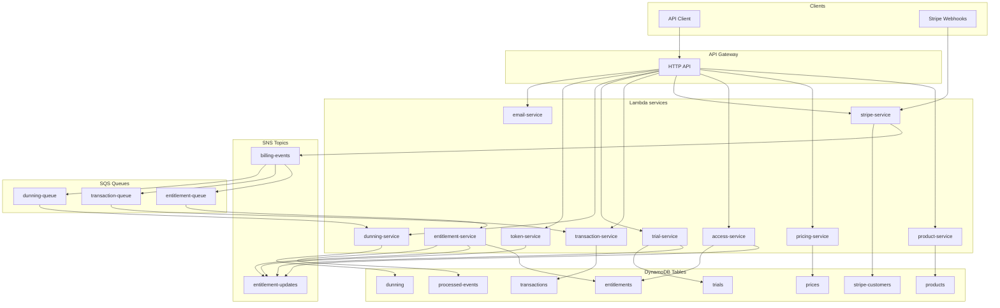

# API, Events & Architecture

## Architecture diagram



**Flow summary**

- **HTTP API** → API Gateway routes to the appropriate Lambda by path prefix (`/products`, `/prices`, `/access`, `/stripe`, `/transactions`, `/trial`, `/dunning`, `/token`, `/email`).
- **Stripe** → `stripe-service` receives webhooks and publishes **billing events** to the **billing-events** SNS topic.
- **billing-events** → Fan-out to three SQS queues: **entitlement-queue**, **transaction-queue**, **dunning-queue**. Each consumer processes the same event for its domain (entitlements, transaction history, dunning state).
- **Entitlement / access / trial / token** services can publish to **entitlement-updates** SNS when entitlements are created, updated, revoked, or when usage/availability changes.

---

## API endpoints

Base URL is the API Gateway base (e.g. `https://{api-id}.execute-api.{region}.amazonaws.com`). Paths below are relative. Most endpoints expect a JWT in `Authorization: Bearer <token>` and resolve `userId` from it unless noted.

---

### Product service (`/products`)

| Method | Path | Description |
|--------|------|-------------|
| POST | `/products` | Create product |
| GET | `/products` | List products (paginated, filterable) |
| GET | `/products/search` | Search products |
| GET | `/products/by-entitlement/{entitlementKey}` | Find product by entitlement key |
| GET | `/products/{id}` | Get product by ID |
| PUT | `/products/{id}` | Update product |
| DELETE | `/products/{id}` | Delete product |

**POST /products**

- **Auth:** Required.
- **Body:** Product create payload: `productId`, `name`, `description?`, `type` (`"subscription"` \| `"one_time"` \| `"addon"`), `entitlements` (array of entitlement keys), `usageLimits?`, `addons?`, `addonConfigs?`, `providers?`, `isActive`.
- **Response:** Created product (or 4xx on validation error).
- **Behavior:** Creates product in DynamoDB; product must have at least one entitlement.

**GET /products**

- **Auth:** Required.
- **Query:** `pageSize`, `pageNumber`, `type`, `isActive`, `entitlementKey`, `namePrefix` (optional).
- **Response:** `{ items: Product[], total?, pageNumber, pageSize }`.
- **Behavior:** List/products from DynamoDB with optional filters and pagination.

**GET /products/search**

- **Auth:** Required.
- **Query:** Search parameters (service-specific).
- **Response:** Matching products.
- **Behavior:** Search products (e.g. by name/entitlement).

**GET /products/by-entitlement/{entitlementKey}**

- **Auth:** Required.
- **Path:** `entitlementKey` – entitlement key (e.g. `token`, `subject_access`).
- **Response:** Product that grants that entitlement, or 404.
- **Behavior:** Resolves product by entitlement key.

**GET /products/{id}**

- **Auth:** Required.
- **Response:** Single product or 404.
- **Behavior:** Get product by primary key.

**PUT /products/{id}**

- **Auth:** Required.
- **Body:** Partial product update (name, description, entitlements, usageLimits, addons, addonConfigs, isActive, etc.).
- **Response:** Updated product.
- **Behavior:** Overwrites/updates product in DynamoDB.

**DELETE /products/{id}**

- **Auth:** Required.
- **Response:** Success or 404.
- **Behavior:** Deletes product record.

---

### Pricing service (`/prices`)

| Method | Path | Description |
|--------|------|-------------|
| POST | `/prices` | Create price |
| GET | `/prices/product/{productId}` | List prices for a product |
| GET | `/prices/{id}` | Get price by ID |
| PUT | `/prices/{id}` | Update price |
| DELETE | `/prices/{id}` | Delete price |

**POST /prices**

- **Auth:** Required.
- **Body:** `priceId`, `productId`, `amount`, `currency`, `interval?` (for recurring), `billingType?`, etc.
- **Response:** Created price.
- **Behavior:** Creates price linked to product.

**GET /prices/product/{productId}**

- **Auth:** Required.
- **Response:** List of prices for the product.
- **Behavior:** Returns all prices for the given product.

**GET /prices/{id}**, **PUT /prices/{id}**, **DELETE /prices/{id}**

- **Auth:** Required.
- **Behavior:** Standard CRUD by price ID.

---

### Access service (`/access`)

| Method | Path | Description |
|--------|------|-------------|
| GET | `/access` | Get user entitlements |
| GET | `/access/:key` | Get entitlement by key |
| POST | `/access/usage/:key` | Increment usage for entitlement |
| DELETE | `/access/entitlements` | Delete all entitlements for user |
| DELETE | `/access/entitlements/:key` | Delete entitlement by key |

**GET /access**

- **Auth:** Required (userId from JWT).
- **Query:** Optional `entitlement_key` to return a single entitlement.
- **Response:** `{ userId, entitlements }` (object or single entitlement when filtered).
- **Behavior:** Returns all entitlements for the user (or the one for the given key). Includes status, usage (limit/used), expiresAt, etc.

**GET /access/:key**

- **Auth:** Required.
- **Path:** `key` – entitlement key (e.g. `token`, `subject_access`).
- **Response:** Single entitlement or 404.
- **Behavior:** Fetch entitlement for the authenticated user by key.

**POST /access/usage/:key**

- **Auth:** Required.
- **Path:** `key` – entitlement key.
- **Body:** `{ amount?: number }` (default 1).
- **Response:** `{ key, usage, limit, remaining }`.
- **Behavior:** Increments usage for the entitlement by `amount`; applies lazy reset if the period has passed; caps at limit. Publishes **entitlement.availability_updated** to **entitlement-updates** SNS with `currentAvailableUsage`.

**DELETE /access/entitlements**  
**DELETE /access/entitlements/:key**

- **Auth:** Required.
- **Behavior:** Deletes all entitlements for the user, or the entitlement for the given key. Used for admin/test cleanup.

---

### Stripe service (`/stripe`)

| Method | Path | Description |
|--------|------|-------------|
| POST | `/stripe/payment-intent` | Create payment intent (checkout) |
| GET | `/stripe/payment-methods` | List payment methods |
| GET | `/stripe/payment-intent/:paymentIntentId/status` | Get payment intent status |
| POST | `/stripe/customer-portal` | Create Stripe Customer Portal session |
| POST | `/stripe/webhook` | Stripe webhook (no JWT) |

**POST /stripe/payment-intent**

- **Auth:** Required.
- **Body:** `priceId` (required), `successUrl`, `cancelUrl` (required), `addonProductIds?`, `paymentMethodId?`.
- **Response:** Stripe client secret and/or session URL for checkout.
- **Behavior:** Creates or reuses Stripe customer, creates Checkout Session or PaymentIntent for the price (and optional add-ons). No SNS from this path; **billing events** are published when Stripe sends webhooks (e.g. `checkout.session.completed`, `payment_intent.succeeded`).

**GET /stripe/payment-methods**

- **Auth:** Required.
- **Response:** `{ paymentMethods: Array<{ id, type, card?, isDefault }> }`.
- **Behavior:** Lists payment methods for the user’s Stripe customer.

**GET /stripe/payment-intent/:paymentIntentId/status**

- **Auth:** Required.
- **Response:** Payment intent status (e.g. succeeded, requires_action, failed).
- **Behavior:** Returns current status of the payment intent.

**POST /stripe/customer-portal**

- **Auth:** Required.
- **Body/Query:** `returnUrl` (required).
- **Response:** `{ url }` – Stripe Customer Portal session URL.
- **Behavior:** Creates a portal session so the user can manage payment methods and subscriptions. Fails if user has no Stripe customer (no prior purchase).

**POST /stripe/webhook**

- **Auth:** Stripe signature verification (no JWT). Body is raw Stripe event.
- **Behavior:** Idempotent processing of Stripe events. On success, publishes **billing events** to **billing-events** SNS. See “Billing events (SNS)” below.

---

### Transaction service (`/transactions`)

| Method | Path | Description |
|--------|------|-------------|
| GET | `/transactions` | Get user transactions |

**GET /transactions**

- **Auth:** Required.
- **Query:** `userId` (admin only), `limit?`.
- **Response:** `{ userId, transactions: Array<{ transactionId, type, status, amount, currency, productId, priceId, subscriptionId, createdAt, metadata }>, count }`.
- **Behavior:** Returns transaction history for the user (or for `userId` when caller is admin). Data is written by the same Lambda when it consumes **billing-events** from **transaction-queue**.

---

### Trial service (`/trial`)

| Method | Path | Description |
|--------|------|-------------|
| POST | `/trial` | Start trial |
| GET | `/trial` | Check trial status |

**POST /trial**

- **Auth:** Required.
- **Body:** `productId` (required), `trialDurationHours?`.
- **Response:** Trial record (e.g. started, expiresAt).
- **Behavior:** Starts a trial for the user for the given product; creates/updates entitlements and can publish to **entitlement-updates**.

**GET /trial**

- **Auth:** Required.
- **Response:** Current trial status for the user (e.g. active, expired, productId, expiresAt).
- **Behavior:** Reads trial record from DynamoDB.

---

### Dunning service (`/dunning`)

| Method | Path | Description |
|--------|------|-------------|
| GET | `/dunning/billing-issue` | Get billing issue (dunning) status |

**GET /dunning/billing-issue**

- **Auth:** Required.
- **Response:** Billing issue payload (state, days since detection, etc.) or “no issue”.
- **Behavior:** Returns dunning state for the user (action_required, grace_period, restricted, suspended, ok). State is updated when the dunning Lambda processes **billing-events** from **dunning-queue**.

---

### Token service (`/token`)

| Method | Path | Description |
|--------|------|-------------|
| POST | `/token/charge` | Charge token entitlement (consume usage) |

**POST /token/charge**

- **Auth:** Required.
- **Body:** `priceId` (required).
- **Response:** Result of token charge (e.g. remaining balance).
- **Behavior:** Consumes token entitlement (usage) for the user; may publish **entitlement.availability_updated** to **entitlement-updates**.

---

### Email service (`/email`)

| Method | Path | Description |
|--------|------|-------------|
| GET | `/email/unsubscribe` | Unsubscribe (link with token) |
| POST | `/email/unsubscribe` | Unsubscribe (body with token) |

**GET /email/unsubscribe**, **POST /email/unsubscribe**

- **Auth:** None (token in query or body).
- **Query/Body:** `token` or `t` – JWT unsubscribe token.
- **Response:** `{ ok: boolean, message: string }`.
- **Behavior:** Verifies JWT and records unsubscribe for the decoded email. No SNS/SQS from this endpoint.

---

## SNS topics

### billing-events

- **Created by:** entitlement-service (or shared infra).
- **Published by:** **stripe-service** (on Stripe webhook handling).
- **Subscribers:** entitlement-queue, transaction-queue, dunning-queue (each queue receives every message).

**Message shape:** Billing domain event (see “Billing event structure” below).

**Stripe → billing-events:** Stripe webhook events are mapped to internal billing event types, e.g.:

- `checkout.session.completed` (mode payment) → `payment.successful`
- `payment_intent.succeeded` → `payment.successful`
- `payment_intent.payment_failed` → `payment.failed`
- `payment_intent.requires_action` → `payment.action_required`
- `invoice.paid` → `payment.successful` or subscription lifecycle
- `customer.subscription.created` → `subscription.created`
- `customer.subscription.updated` → `subscription.updated`
- `customer.subscription.deleted` → `subscription.expired`
- `invoice.payment_failed` → `payment.failed` (and dunning)

---

### entitlement-updates

- **Created by:** access-service.
- **Published by:** access-service (after increment usage), entitlement-service (after create/update/revoke entitlements), trial-service, token-service (after usage/charge).

**Message shape:** Entitlement event (see “Entitlement events (entitlement-updates)” below).

**Event types:**

- `entitlement.created`
- `entitlement.updated`
- `entitlement.revoked`
- `entitlement.availability_updated` (payload: `userId`, `key`, `currentAvailableUsage`)

---

## SQS queues and consumers

### entitlement-queue

- **Subscribes to:** billing-events (SNS).
- **Consumer:** entitlement-service Lambda (SQS trigger).
- **Behavior:** Parses SNS-wrapped billing event, runs **ProcessBillingEventUseCase**. Creates/updates/revokes entitlements, syncs product limits, publishes to **entitlement-updates**.
- **Message structure:** SNS notification; `Message` body is JSON of a **billing domain event**.

### transaction-queue

- **Subscribes to:** billing-events (SNS).
- **Consumer:** transaction-service Lambda (SQS trigger).
- **Behavior:** Parses billing event, appends transaction record to DynamoDB (PK/SK by user and time).
- **Message structure:** Same as entitlement-queue (SNS → `Message` = billing event JSON).

### dunning-queue

- **Subscribes to:** billing-events (SNS).
- **Consumer:** dunning-service Lambda (SQS trigger).
- **Behavior:** On payment failed / action required, creates or updates dunning record (state machine: action_required → grace_period → restricted → suspended). On payment success, clears dunning. Can publish to **entitlement-updates** when revoking after suspend.
- **Message structure:** Same as above (billing event in SNS `Message`).

---

## Event data structures

### Billing event structure (billing-events SNS)

Every message is a **billing domain event**:

```ts
{
  type: string;           // e.g. "payment.successful", "subscription.created"
  payload: object;        // See PaymentPayload / SubscriptionPayload below
  meta: {
    eventId: string;
    occurredAt: string;   // ISO
    source: "stripe" | "powertranz" | "internal";
    correlationId?: string;
  };
  version: number;
}
```

**Payment event types:** `payment.successful`, `payment.action_required`, `payment.failed`.

**PaymentPayload:**

```ts
{
  paymentIntentId: string;
  userId: string;
  amount: number;
  currency: string;
  priceId: string;
  productId?: string;
  subscriptionId?: string;
  billingType?: "one_time" | "recurring";
  provider: "stripe" | "powertranz";
  failureCode?: string;
  failureReason?: string;
  portalUrl?: string;
  expiresAt?: string;   // ISO
}
```

**Subscription event types:** `subscription.created`, `subscription.updated`, `subscription.canceled`, `subscription.paused`, `subscription.resumed`, `subscription.expired`.

**SubscriptionPayload:**

```ts
{
  subscriptionId: string;
  userId: string;
  productId: string;
  priceId: string;
  status: "active" | "paused" | "canceled" | "expired" | "trialing" | "past_due";
  currentPeriodStart: string;   // ISO
  currentPeriodEnd: string;    // ISO
  cancelAtPeriodEnd?: boolean;
  previousProductId?: string;
  addonProductIds?: string[];
}
```

---

### Entitlement events (entitlement-updates SNS)

**entitlement.created / entitlement.updated / entitlement.revoked**

```ts
{
  type: "entitlement.created" | "entitlement.updated" | "entitlement.revoked";
  payload: {
    userId: string;
    entitlementKey: string;
    role?: string;
    status: "active" | "inactive";
    expiresAt?: string;
    usageLimit?: { limit: number; used: number };
    productId?: string;
    subscriptionId?: string;
    reason: string;   // e.g. "subscription.created", "payment.successful"
  };
  meta: { eventId: string; occurredAt: string; source: string };
  version: number;
}
```

**entitlement.availability_updated**

```ts
{
  type: "entitlement.availability_updated";
  payload: {
    userId: string;
    key: string;
    currentAvailableUsage: number | null;   // limit - used, or null if not usage-based
  };
  meta: { eventId: string; occurredAt: string; source: string };
  version: number;
}
```

---

## End-to-end flows

1. **One-time purchase**
   - Client calls **POST /stripe/payment-intent** → user completes Stripe Checkout.
   - Stripe sends **checkout.session.completed** or **payment_intent.succeeded** → stripe-service publishes **payment.successful** to **billing-events**.
   - **entitlement-queue** → entitlement-service creates/updates entitlements (and permanent limits for one-time).
   - **transaction-queue** → transaction-service stores transaction.
   - **dunning-queue** not applied for success.

2. **Subscription lifecycle**
   - Stripe sends **customer.subscription.created/updated/deleted** (and **invoice.paid** / **invoice.payment_failed**) → stripe-service publishes **subscription.created/updated/expired** (and payment events) to **billing-events**.
   - Entitlement-service updates entitlements and expiration; on renewal, may reset usage for `billing_cycle`; on cancel/expire, revokes (subject to dunning).
   - Transaction-service records each payment/subscription event.
   - Dunning-service reacts to **payment.failed** / **payment.action_required** and moves state; after **suspended**, entitlement-service may revoke access.

3. **Usage increment**
   - Client calls **POST /access/usage/:key** with optional `amount` → access-service increments usage, then publishes **entitlement.availability_updated** to **entitlement-updates** with new `currentAvailableUsage`.

4. **Billing issue check**
   - Client calls **GET /dunning/billing-issue** → dunning-service returns current dunning state (and optionally portal URL) from DynamoDB.

For full details on entitlements, usage, reset strategies, and limits, see **[Entitlements reference](./entitlements-reference.md)**.
