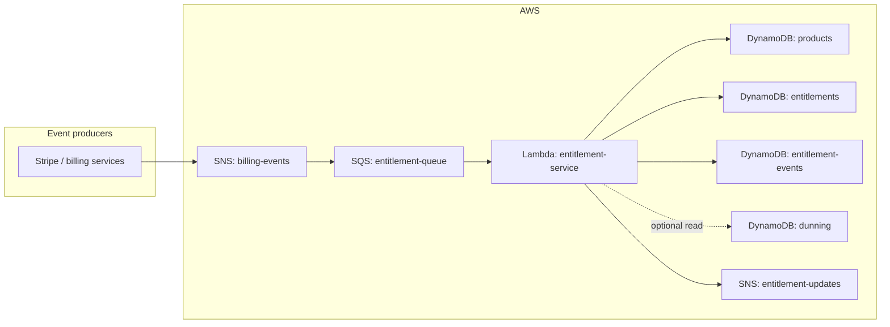
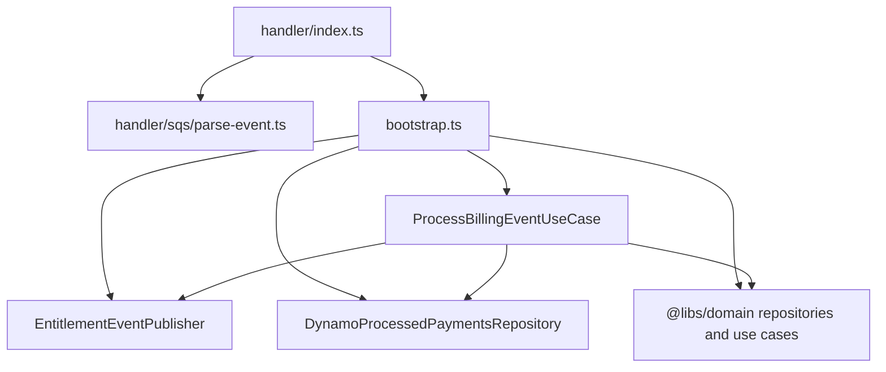

# Entitlement Service — Architecture and Implementation

This document describes how the **entitlement-service** works inside the Eislett education payment platform: runtime behavior, AWS integration, dependencies on shared libraries, and what each source file is responsible for. It is written from the current TypeScript implementation in this package.

## Role in the platform

The entitlement service is a **Node.js 20 AWS Lambda** function that consumes **billing domain events** from **SQS**. Those messages typically originate from **SNS** (publishers such as Stripe-related services) wrapped in the standard SNS-to-SQS envelope.

For each supported event, the service **reads product configuration** from DynamoDB, **creates, updates, or revokes user entitlements** in the entitlements table, applies **usage limit sync** (including add-on and one-off payment rules), optionally consults **dunning state** before revoking access, and **publishes entitlement lifecycle events** to a dedicated SNS topic so downstream systems (learner APIs, notifications, analytics) can react.

It does **not** expose HTTP APIs; it is purely event-driven.

---

## End-to-end flow



1. A producer publishes a **billing event** JSON document to the **billing-events** SNS topic (shape: `type`, `payload`, `meta`, `version` — see `@libs/domain` billing events).
2. SNS delivers to **entitlement-queue** SQS; Lambda is triggered with up to **10** records per invocation (Terraform `batch_size = 10`).
3. `src/handler/index.ts` parses each SQS record into a `BillingEvent.BillingDomainEvent`.
4. `ProcessBillingEventUseCase.execute` routes on `event.type`, mutates entitlements via repositories and use cases from `@libs/domain`, then publishes **per-entitlement** messages to **entitlement-updates** SNS.
5. On per-record failure, the handler returns **`batchItemFailures`** with that record’s `messageId` so only failed messages are retried (partial batch failure reporting enabled on the event source mapping).

---

## Source layout and file responsibilities

All application logic lives under `src/`. Compiled output is `dist/` (TypeScript `outDir`). Deployment packaging uses `npm run package`, which bundles `src/handler/index.ts` with esbuild into `dist/index.js` inside `function.zip` (handler `index.handler` per Terraform).

| Path | Responsibility |
|------|----------------|
| **`src/handler/index.ts`** | Lambda entrypoint. Calls `bootstrap()`, uses `parseSqsEvent` to turn `SQSEvent` into billing events, loops **in lockstep** with `event.Records[i]`, invokes `processBillingEventUseCase.execute` per message, collects `SQSBatchItemFailure` for retries. On top-level parse/bootstrap failure, marks **all** records failed. |
| **`src/handler/sqs/parse-event.ts`** | Parses SQS body JSON. If body looks like an SNS notification (`Type === "Notification"` and `Message` present), parses inner `Message` as the billing event; otherwise treats body as the event directly. Validates presence of `type`, `payload`, and `meta`. |
| **`src/bootstrap.ts`** | Composition root: reads env vars, constructs `DynamoProductRepository`, `DynamoEntitlementRepository`, `CreateEntitlementUseCase`, `SyncProductLimitsToEntitlementsUseCase`, `EntitlementEventPublisher`, `DynamoProcessedPaymentsRepository`, optional `DynamoDunningRepository`, wires `ProcessBillingEventUseCase`, returns `{ processBillingEventUseCase }`. |
| **`src/app/usecases/process.billing.event.usecase.ts`** | Core orchestration: filters certain payment events, switches on subscription/payment event types, implements subscription lifecycle, add-ons, billing-cycle renewal detection, revocation with dunning checks and permanent-limit preservation, one-off payment idempotency, and post-processing SNS fan-out of entitlement snapshots. |
| **`src/infrastructure/event.publisher.ts`** | `EntitlementEventPublisher`: wraps `@aws-sdk/client-sns`, reads `ENTITLEMENT_UPDATES_TOPIC_ARN`, publishes typed entitlement events with `MessageAttributes.eventType`. **Swallows errors** so publish failures do not fail entitlement writes. |
| **`src/infrastructure/processed-payments.repository.ts`** | `DynamoProcessedPaymentsRepository`: idempotency for **one-off** payments using composite key `eventId = PAYMENT#{paymentIntentId}` in `PROCESSED_EVENTS_TABLE`, with DynamoDB **TTL** (`ttl`) set **90 days** ahead. |

### Supporting / generated artifacts (not hand-edited for behavior)

- **`package.json`** — Scripts: `build` (tsc), `package` (esbuild bundle + zip), `type-check`, `clean`.
- **`tsconfig.json`** — Strict TypeScript, CommonJS, ES2020, declarations/source maps for `dist/`.
- **`README.md`** — Operator-focused overview (some sections describe **general** event idempotency by `meta.eventId`; see [Idempotency](#idempotency) below for what this repo actually implements).
- **`dist/`**, **`function.zip`** — Build/deploy outputs.

---

## Layered architecture (within the service)

The service follows a thin **hexagonal / clean** style:

- **Handler** — AWS Lambda and SQS/SNS transport only; no business rules.
- **Bootstrap** — Wires ports to concrete adapters (DynamoDB, SNS).
- **Use case** — `ProcessBillingEventUseCase` owns billing→entitlement policy.
- **Infrastructure** — SNS publisher and Dynamo idempotency adapter specific to this service’s needs.
- **Domain & persistence** — Delegated to **`@libs/domain`**: entities, value objects, Dynamo repositories, and entitlement/product use cases.



---

## Dependency: `@libs/domain`

The workspace package **`@libs/domain`** (`libs/domain` in the payment monorepo) supplies:

- **Billing event types** (`BillingEvent.*`) consumed by the parser and use case.
- **Product repository** (`DynamoProductRepository` / `ProductRepositoryPorts`) — product definitions, entitlement keys, add-on configs (`addonConfigs`, legacy `addons`), usage limit metadata.
- **Entitlement repository** (`DynamoEntitlementRepository` / `EntitlementRepository`) — load/update user entitlements by user and key.
- **Use cases** — `CreateEntitlementUseCase` (new rows), `SyncProductLimitsToEntitlementsUseCase` (sync limits; **additive** behavior when `isAddon: true`, one-off semantics when `isOneTimePayment` is passed for base sync).
- **Dunning** — `DynamoDunningRepository`, `DunningRepository`, `DunningState`, and helpers on the dunning record used to **delay revocation** while the user is in early dunning phases.

The entitlement service **does not** redefine product or entitlement schemas; it orchestrates those libraries.

---

## Environment variables

| Variable | Required | Purpose |
|----------|----------|---------|
| `PRODUCTS_TABLE` | Yes | DynamoDB table name for products (from product-service Terraform outputs in deployed env). |
| `ENTITLEMENTS_TABLE` | Yes | DynamoDB table name for user entitlements (from access-service outputs). |
| `PROCESSED_EVENTS_TABLE` | Yes | DynamoDB table for idempotency records (see below). |
| `ENTITLEMENT_UPDATES_TOPIC_ARN` | Yes | SNS topic ARN for outbound entitlement events. |
| `DUNNING_TABLE` | No | If set, `DynamoDunningRepository` is constructed; `revokeEntitlements` consults dunning before revoking. Terraform sets this to the conventional dunning table name. |

AWS SDK v3 clients use the default credential chain and region resolution of the Lambda runtime.

---

## Event routing (`ProcessBillingEventUseCase.execute`)

### Ignored / skipped at the start

- **`payment.failed`**, **`payment.action_required`** — Logged and **returned immediately**. Rationale in code: failures are part of the **dunning** timeline; this service must not revoke entitlements on those events alone.

### Handled event types (high level)

| Event | Behavior summary |
|-------|-------------------|
| **`subscription.created`** | `createEntitlementsFromProduct` for base product; add-ons from `payload.addonProductIds` **or** from product `addonConfigs` / legacy `addons`; publishes entitlement events. |
| **`subscription.updated`** | If `previousProductId` differs from `productId`, **revokes** entitlements for the old product immediately. Detects **billing cycle renewal** via `isBillingCycleRenewal`; recreates/syncs base + add-ons with renewal flag for usage resets; publishes. |
| **`subscription.canceled`** | If `cancelAtPeriodEnd`, sets expiration to `currentPeriodEnd` without immediate revoke; else immediate revoke path. Publishes. |
| **`subscription.expired`** | Immediate revoke. Publishes. |
| **`subscription.paused`** | **No entitlement mutation** — log only (comment notes possible future “inactive” status). |
| **`subscription.resumed`** | Re-activates base entitlements with new `currentPeriodEnd`. Publishes. |
| **`payment.successful`** | If `productId` missing, skip. Distinguishes **one-time** vs subscription payment; one-time uses permanent-limit path and **paymentIntentId** idempotency; publishes. |
| **Other types** | Logged as unhandled; no throw. |

### Role extraction

`extractRole` currently **always returns `"learner"`** and logs the full event (intended for future integration with a user service). All entitlement rows created here use that role unless the domain library overrides elsewhere.

---

## Core private methods (use case internals)

- **`createEntitlementsFromProduct`** — Loads product; for each product entitlement key, activates or creates entitlement, sets `expiresAt` (except one-off path), handles **billing_cycle** and periodic **usage reset** via `usage.shouldReset()`, then calls **`syncProductLimitsUseCase.execute`** for the base product (`isAddon: false`).
- **`processAddons` / `processAddonProduct`** — Resolves add-on products from config or event; creates/updates entitlement rows; syncs limits with **`isAddon: true`** (additive limits for matching keys).
- **`isBillingCycleRenewal`** — Compares subscription `currentPeriodStart` to existing entitlements’ `expiresAt` (with a small negative tolerance in ms) across product entitlement keys to infer renewal.
- **`revokeEntitlements`** — Recursive over base product and configured add-on products. **Dunning guard**: if repo present and user is in `ACTION_REQUIRED`, `GRACE_PERIOD`, or `RESTRICTED`, revocation is skipped to preserve access during the grace timeline. **Permanent limits**: if `usage.permanentLimit > 0`, immediate “revoke” keeps entitlement **active**, clears subscription limit to 0, preserves permanent limit, clears reset strategy. Otherwise status → `REVOKED`. Non-immediate path sets `expiresAt` for end-of-period revoke.
- **`handlePaymentSuccessful`** — One-off: `createEntitlementsFromProduct(..., isOneTimePayment: true)`; subscription payment path passes `isOneTimePayment: false` and may omit expiration depending on payload (see code for `expiresAt` usage).
- **`publishEntitlementEvents`** — Loads **all** entitlements for the user via `entitlementRepo.findByUser`, builds payloads with status, optional usage, `productId`, and string `reason`, then calls **`publishCreated`**, **`publishUpdated`**, or **`publishRevoked`** based on substring checks on `reason`. Errors are logged and not rethrown.

---

## Outbound SNS (`EntitlementEventPublisher`)

Publishes strongly typed events from `@libs/domain` billing/entitlement event enums:

- `ENTITLEMENT_CREATED`
- `ENTITLEMENT_UPDATED`
- `ENTITLEMENT_REVOKED`

Each message is JSON-stringified; **`MessageAttributes.eventType`** is set for filter policies. Implementation **catches and logs** publish errors so entitlement persistence still succeeds.

---

## Idempotency

**Implemented in code today:**

- **One-off (`payment.successful`)** — When `billingType === "one_time"` or there is no `subscriptionId`, and `paymentIntentId` is present, the service checks **`PROCESSED_EVENTS_TABLE`** for item key `eventId = PAYMENT#{paymentIntentId}`. If found, processing is skipped. After successful application, the same key is written with **`ttl`** = now + **90 days**.

**Not implemented in this service’s TypeScript** (despite the DynamoDB table name “entitlement-events” and generic `eventId` key design):

- **Deduping every billing event by `meta.eventId`** — The handler logs `meta.eventId`, but the use case does **not** persist or check generic event IDs for subscription events. Operational deduplication relies on **SQS at-least-once** behavior and safe entitlement operations, not a global processed-event log in this package.

If you need strict once-only processing per `meta.eventId`, that would be an additional concern (e.g. conditional write on `eventId` before handling).

---

## Lambda batching and failure semantics

- **Success** — Returns `{ batchItemFailures: [] }` (or only failures for failed indices).
- **Per-message failure** — Adds `itemIdentifier: record.messageId` so SQS retries that message; after **maxReceiveCount** (3), message moves to **DLQ** (`entitlement-dlq`).
- **Fatal batch error** (e.g. parse failure before loop) — All `messageId`s reported as failed.

**Ordering note:** `parseSqsEvent` maps **all** records to billing events before the loop; the handler assumes **billingEvents[i]** corresponds to **`event.Records[i]`**. That matches normal single-event-per-SQS-message usage.

---

## Terraform (deployed infrastructure)

Under `infra/services/entitlement-service/main.tf` (paths relative to payment repo root):

- **SNS** — `${project}-${env}-billing-events`, `${project}-${env}-entitlement-updates`.
- **SQS** — `${project}-${env}-entitlement-queue` (long polling, visibility timeout 300s), **DLQ** with redrive max 3.
- **SNS → SQS** subscription and queue policy scoped to the billing topic ARN.
- **DynamoDB** — `${project}-${env}-entitlement-events` (PK `eventId`, TTL on `ttl`).
- **Lambda** — `${project}-${env}-entitlement-service`, handler `index.handler`, zip from `services/entitlement-service/function.zip`.
- **IAM** — Reads products + entitlements + processed-events tables (+ optional dunning ARN); receives/deletes SQS; publishes to entitlement-updates SNS only.
- **Event source mapping** — `ReportBatchItemFailures` enabled, `batch_size = 10`.

Remote state pulls **product** and **access** stack outputs for table names/ARNs.

---

## Build and run locally

From `services/entitlement-service`:

```bash
npm install
npm run build        # tsc → dist/
npm run type-check   # no emit
npm run package      # esbuild bundle + function.zip for Lambda
```

Local execution would require AWS credentials and tables/topics matching the env vars above; there is no embedded HTTP server.

---

## Operational and code-quality notes

- **`publishEntitlementEvents`** publishes **every** entitlement for the user after an operation, not only keys touched by the product — downstream consumers should be aware of fan-out volume.
- **`extractRole`** contains a **`console.log(event)`** that will log full payloads in production unless removed — worth tightening for log cost and PII.
- **README** vs **code**: align documentation on whether **`meta.eventId`** is stored in `PROCESSED_EVENTS_TABLE` for all events; currently only **`PAYMENT#...`** keys are used by `DynamoProcessedPaymentsRepository`.

---

## Quick reference: “where do I change X?”

| Change | Location |
|--------|----------|
| SQS / SNS envelope parsing | `src/handler/sqs/parse-event.ts` |
| Retry / batch failure behavior | `src/handler/index.ts` |
| Wiring repositories and env validation | `src/bootstrap.ts` |
| Billing event → entitlement rules | `src/app/usecases/process.billing.event.usecase.ts` |
| Outbound SNS message shape / attributes | `src/infrastructure/event.publisher.ts` |
| One-off payment idempotency TTL / key format | `src/infrastructure/processed-payments.repository.ts` |
| Product / entitlement persistence, limit sync math | `@libs/domain` (`libs/domain`) |

This file should be updated when event types, idempotency strategy, or Terraform wiring change.
